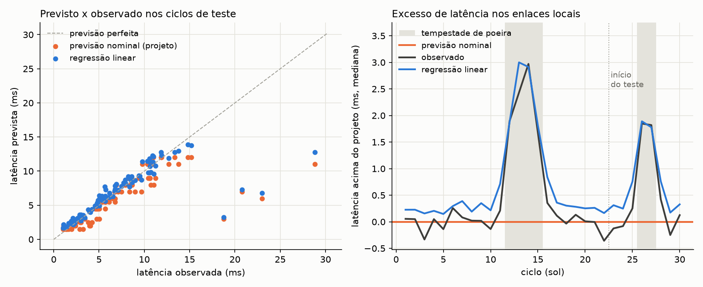

# SCIC — Sistema de Comunicação Interplanetária da Colônia

**Relatório técnico · Atividade integradora da Fase 6**
Ciência da Computação (online) · FIAP · 2026

| Integrante | RM |
|---|---|
| Gabriel Carmona Bittencourt | RM569239 |
| Iúri Leão de Almeida | RM570215 |
| Márcio Francisco dos Santos Júnior | RM570758 |
| Maria Sophia Domingues dos Santos | RM571209 |

Repositório: <https://github.com/iurileao-hub/aurora-siger-fase-6>

---

## 1. Contexto

Uma mensagem enviada da Aurora Siger leva entre 3 e 22 minutos para chegar à Terra,
conforme a posição dos dois planetas na órbita. Nos 30 ciclos que analisamos, a distância
ficou entre 228 e 244 milhões de km, o que dá de 12 min 40 s a 13 min 34 s só de viagem
da luz. Nenhuma pergunta feita à Terra volta em menos de 25 minutos, então a colônia precisa
saber por conta própria quais enlaces estão degradados, qual alerta atender primeiro e quanto
pode confiar nas próprias previsões.

O SCIC é o protótipo que faz esse acompanhamento. Ele lê as medições dos sensores de enlace
dos 13 módulos da colônia (os mesmos das fases anteriores do projeto), compara a latência
medida com a latência prevista, treina um modelo simples para prever a latência nos enlaces
internos, organiza os alertas por urgência com um heap e permite buscar módulos, sensores e
alertas por prefixo com uma trie. Tudo roda no terminal, a partir de um menu.

O código está em `codigo_fonte.py`. A base é gerada por `gerar_dados.py` e fica salva em
`dados_aurora_siger.csv`. A execução completa (`python codigo_fonte.py --demo`) está registrada
em `graficos_ou_imagens/exemplo_execucao.txt`, e todos os números deste relatório saem dela.

## 2. Os dados

### 2.1 O que cada registro representa

Cada linha do CSV é a leitura do sensor de enlace de um módulo em um ciclo (um sol marciano).
São 13 módulos × 30 ciclos = 390 registros, com estes campos:

| Campo | Significado |
|---|---|
| `ciclo` | sol do registro (1 a 30) |
| `modulo`, `tipo` | nome e função do módulo (habitação, agricultura, laboratório...) |
| `prioridade` | 1 = vital, 2 = sustento, 3 = expansão |
| `codigo_sensor` | identificador de 16 bits do sensor, em hexadecimal (seção 7) |
| `enlace` | `local` (até o hub da colônia) ou `Terra` |
| `carga_rede_pct` | ocupação do enlace, em % |
| `opacidade_tau` | opacidade da atmosfera; acima de 1,0 consideramos tempestade de poeira |
| `tensao_v`, `corrente_a` | tensão e corrente no transceptor do módulo |
| `latencia_prevista_ms` | latência de projeto do enlace |
| `latencia_observada_ms` | latência medida no ciclo |
| `status`, `mensagem` | situação informada pelo próprio módulo (ativo, manutenção ou alerta) |

O programa acrescenta, ao carregar, as colunas que se calculam a partir das outras: potência
(P = V · I), resistência equivalente (R = V / I), erro absoluto, erro relativo e a avaliação
do erro. Preferimos calcular esses valores na carga em vez de gravá-los no CSV: se alguém
corrigir a tensão de um registro, uma potência gravada ficaria desatualizada sem nenhum aviso.

### 2.2 Como a base foi construída

A base é simulada, mas segue regras físicas simples que ficam explícitas em `gerar_dados.py`.
A semente aleatória é fixa, então quem rodar o gerador obtém exatamente o mesmo arquivo.

- **Enlace com a Terra** (módulo Comunicações): a previsão é a distância dividida pela
  velocidade da luz, mais 1,5 s de processamento nas estações de retransmissão. A observação
  acrescenta a fila de transmissão, que cresce com a carga, e as retransmissões causadas pela
  poeira.
- **Enlaces locais**: cada módulo tem uma latência de projeto entre 1,5 e 12 ms, medida com
  carga normal e céu limpo. A observação se afasta dela quando a carga sobe, quando a poeira
  atrapalha os enlaces de rádio (os cabeados sofrem bem menos) e quando a rede passa de 80% de
  ocupação, ponto a partir do qual a fila cresce rápido. Em cerca de 3% dos registros acontece
  uma rajada de retransmissões, que soma de 8 a 20 ms sem nenhum aviso prévio.
- **Clima**: duas tempestades de poeira, uma forte (ciclos 12 a 15, tau de até 2,46) e uma
  moderada (ciclos 26 e 27, tau de até 1,63). Durante as tempestades, os módulos vitais mandam
  mais telemetria e a carga da rede deles sobe.
- **Energia**: o barramento é de 28 V em corrente contínua. Os módulos ligados ao ramo dos
  painéis solares perdem tensão quando a poeira cobre os painéis. Os transceptores consomem
  potência constante, então quando a tensão cai a corrente aumenta.
- **Eventos registrados pela equipe de operações**: três manutenções programadas e duas
  falhas de sensor. Nesses cinco registros não há latência medida.

### 2.3 Leitura e limpeza

O CSV é lido com Pandas. Os cinco registros sem latência ficam na base, porque contam para a
disponibilidade do módulo, mas saem de todos os cálculos de erro e do modelo. Comparar
previsão com um valor que não foi medido produziria um número sem significado. Na tabela de
indicadores, por isso, a disponibilidade da Energia Eólica aparece como 93,3%: uma manutenção
e uma falha de sensor em 30 ciclos.

## 3. Indicadores e erros numéricos

### 3.1 Definições

Para cada registro com leitura, o SCIC calcula:

- **erro absoluto** = |latência observada − latência prevista|, em milissegundos;
- **erro relativo** = erro absoluto / latência observada.

Usamos a latência observada no denominador porque ela é o valor de referência: é o que de
fato aconteceu, e a previsão é a aproximação que está sendo julgada.

### 3.2 Por que os dois erros contam histórias diferentes

| Enlace | Registros | Erro absoluto médio | Erro absoluto máximo | Erro relativo médio | Erro relativo máximo |
|---|---|---|---|---|---|
| Terra | 30 | 779 ms | 3.365 ms | 0,10% | 0,43% |
| Local | 355 | 1,12 ms | 17,8 ms | 14,6% | 97,9% |

Olhando só o erro absoluto, o enlace com a Terra seria o pior da colônia, com erros de
segundos. Olhando só o relativo, seria o mais confiável, sempre abaixo de 0,5%. As duas
leituras estão certas, e é por isso que o SCIC usa um critério para cada enlace:

- **Terra, pelo erro absoluto.** O que importa para a operação é quantos segundos a mais a
  mensagem levou, porque as janelas de comando com a Terra são agendadas pela previsão. Um
  atraso de 3 s em 13 minutos é pequeno em proporção, mas pode fazer o comando chegar depois
  que a janela fechou. Até 1 s consideramos aceitável; de 1 a 2,5 s, atenção; acima de 2,5 s,
  preocupante.
- **Enlaces locais, pelo erro relativo.** Três milissegundos a mais quase não afetam um enlace
  de 12 ms, mas triplicam o de 1,5 ms do Centro de Controle. Até 25% consideramos aceitável;
  de 25% a 50%, atenção; acima de 50%, preocupante.

Esses limiares foram definidos pela equipe para o protótipo. Numa colônia real, eles
viriam dos requisitos de cada sistema e seriam revistos com o uso. Com eles, os 385 registros
com leitura ficaram assim: 319 aceitáveis, 42 de atenção e 24 preocupantes.

Um cuidado com o erro relativo: quando o valor de referência é muito pequeno, qualquer
diferença vira uma porcentagem grande. A menor latência local medida foi 0,758 ms, num ciclo
em que o Centro de Controle respondeu mais rápido que o previsto, e mesmo assim o erro
relativo passou de 97%. Por isso o SCIC só gera alerta de latência quando a observada fica
**acima** da prevista. Um enlace mais rápido que o esperado entra na avaliação da qualidade da
previsão, mas não representa risco para a operação.

### 3.3 Ponto flutuante e arredondamento

O computador guarda números reais em ponto flutuante, com uma quantidade fixa de bits. O
exemplo clássico aparece no próprio programa: `0.1 + 0.2` resulta em `0.30000000000000004`,
e a comparação com `0.3` dá `False`. Por isso, quando é preciso comparar valores calculados, o
certo é usar uma tolerância (`math.isclose`) em vez de `==`.

Mais útil para o SCIC é saber se essa imprecisão afeta nossas conclusões. A função
`analise_ponto_flutuante` mede o espaço entre um número e o próximo número representável:

| Valor | Tipo | Espaço até o próximo número |
|---|---|---|
| 815.606,775 ms (maior latência da Terra) | float64 | 1,2 × 10⁻¹⁰ ms |
| 815.606,775 ms | float32 | 0,0625 ms |
| 0,758 ms (menor latência local) | float32 | 6,0 × 10⁻⁸ ms |

Com float64, que é o padrão do Python e do Pandas, a representação é muito mais fina que
qualquer medição. O float32, comum em microcontroladores de sensores, já perde resolução nos
valores grandes: um sensor que guardasse a latência da Terra em milissegundos com float32 não
conseguiria distinguir diferenças menores que 0,06 ms. Para os nossos erros, que são de
segundos, isso continua irrelevante, mas mostra que o mesmo tipo de dado pode servir bem a uma
escala e não a outra.

O CSV guarda três casas decimais, então o arredondamento erra no máximo 0,0005 ms, bem abaixo
de qualquer erro de previsão que medimos. Nos dados do SCIC, o erro que pesa nas decisões vem
do modelo e do sensor; o da representação numérica é desprezível.

## 4. Modelo de previsão e avaliação

### 4.1 O modelo

Treinamos uma regressão linear (`LinearRegression`, do scikit-learn) para prever a latência dos
enlaces locais a partir de três variáveis: carga da rede, opacidade da atmosfera e latência de
projeto do enlace. O enlace com a Terra ficou de fora: o atraso dele é quase todo tempo de
viagem da luz, que a previsão de projeto já calcula com erro abaixo de 1%.

Ciclo e código do sensor não entram como variáveis. Eles identificam o registro e não têm
relação física com a latência. Se entrassem, o modelo poderia aprender a reconhecer
registros específicos em vez de explicar o fenômeno, e o resultado pareceria bom no papel sem
servir para ciclos futuros.

A divisão entre treino e teste segue o tempo: treinamos com os ciclos 1 a 22 (260 registros) e
testamos com os ciclos 23 a 30 (95 registros). Uma divisão aleatória misturaria dias do mesmo
período no treino e no teste, e o modelo seria avaliado num cenário mais fácil que o real, em
que sempre se prevê o futuro a partir do passado. Os ciclos de teste incluem a segunda
tempestade, que o modelo não viu durante o treino.

Não separamos um conjunto de validação. Ele serve para escolher hiperparâmetros ou comparar
versões do modelo antes do teste final, e a regressão linear simples não tem hiperparâmetro: os
coeficientes saem de uma fórmula fechada.

A equação obtida foi:

> latência = −0,822 + 0,008 × carga + 1,347 × tau + 1,027 × latência de projeto

O coeficiente da latência de projeto fica perto de 1, o que faz sentido: o ponto de partida de
cada enlace é o seu valor de projeto. Cada unidade a mais de opacidade acrescenta cerca de
1,35 ms. O peso da carga ficou pequeno porque, nos nossos dados, a carga dos módulos vitais
sobe justamente durante as tempestades, e o modelo atribuiu à opacidade boa parte do efeito
que vem das duas juntas.

### 4.2 Métricas

Comparamos o modelo com a previsão que a colônia já tinha, que é a latência de projeto. Sem
essa comparação, não teríamos como dizer se o modelo vale o esforço.

| Previsão (ciclos de teste) | MAE | MSE | RMSE | R² |
|---|---|---|---|---|
| Latência de projeto | 1,433 ms | 12,198 | 3,493 ms | 0,484 |
| Regressão linear | 1,214 ms | 10,416 | 3,227 ms | 0,559 |

- **MAE** (erro absoluto médio): em média, a regressão erra 1,21 ms.
- **MSE** (erro quadrático médio): eleva cada erro ao quadrado antes da média, então pune os
  erros grandes. A unidade é ms², o que dificulta a leitura direta.
- **RMSE** (raiz do MSE): volta à unidade original (ms), mas carrega o peso maior dos erros
  grandes.
- **R²**: fração da variação da latência que o modelo explica. Com 1 o modelo explicaria tudo;
  com 0 ele não seria melhor que chutar a média.

### 4.3 O que as métricas escondem

Se olhássemos só a tabela acima, concluiríamos que o modelo melhora pouco (o MAE cai 15%).
Separar o teste por condição do céu mostra outra coisa:

| Condição (teste) | Registros | MAE do projeto | MAE da regressão |
|---|---|---|---|
| Tempestade (tau > 1) | 24 | 2,47 ms | 1,36 ms |
| Céu limpo | 71 | 1,08 ms | 1,16 ms |

Nas tempestades o modelo reduz o erro em 45%. Com céu limpo, a latência de projeto já é tão
boa quanto ele, e até um pouco melhor. A média geral dilui o ganho porque a maior parte dos
ciclos de teste tem céu limpo.

O segundo sinal está na distância entre MAE e RMSE. O RMSE é 2,7 vezes o MAE, o que indica
que poucos registros concentram erros grandes. São quatro rajadas de retransmissão, com erro
acima de 8 ms, que nenhuma das variáveis do modelo consegue anunciar. Sem esses quatro
registros, o R² sobe de 0,56 para 0,96 e o RMSE cai para 0,73 ms. Os dois valores de R²
descrevem o mesmo modelo. O primeiro está deprimido por quatro registros; o segundo parece
excelente porque esses registros foram retirados, e eles continuam acontecendo na operação
real, justamente nos momentos em que um erro de previsão mais atrapalha.

Há ainda um efeito do próprio método. A regressão linear minimiza a soma dos erros ao
quadrado, então as rajadas do período de treino puxam a reta para cima. O gráfico mostra isso:
com céu limpo, a curva do modelo fica cerca de 0,3 ms acima da observada, o que explica a
pequena desvantagem dele nesses ciclos.

*À esquerda, cada ponto é um registro de teste: quanto mais perto da diagonal, melhor a
previsão. Os pontos isolados à direita são as rajadas. À direita, a mediana do quanto a
latência passou do valor de projeto em cada ciclo: o modelo acompanha as duas tempestades, e
a previsão de projeto continua em zero.*

Não usamos AIC, BIC nem busca de hiperparâmetros. Com um único modelo comparado a uma
referência fixa, não havia hiperparâmetro a ajustar nem modelos concorrentes a ordenar.
Esses critérios entrariam se testássemos versões do modelo com conjuntos diferentes de
variáveis, o que deixamos como melhoria na seção 10.

## 5. Priorização de alertas com heap

### 5.1 Como os alertas são representados

Cada alerta é um dicionário com ciclo, módulo, código do sensor, prioridade do módulo, origem,
categoria, descrição, gravidade e urgência. Os alertas vêm de duas fontes:

- **informados pelo próprio módulo** (status `alerta` no CSV): subtensão no barramento e sensor
  sem resposta;
- **detectados pelo SCIC**: latência acima da prevista com erro na faixa preocupante.

No período foram 32 alertas: 18 de latência alta nos enlaces locais, 4 de atraso no enlace
com a Terra, 8 de subtensão e 2 de sensor sem resposta.

### 5.2 Critério de prioridade

A urgência combina dois fatores, como numa matriz de risco:

> urgência = peso do módulo × gravidade do evento

O peso é 3 para módulos vitais, 2 para os de sustento e 1 para os de expansão. A gravidade é 2
(alta) ou 3 (crítica). Um erro de latência acima de 75%, uma tensão abaixo de 26 V e um atraso
de mais de 3 s no enlace com a Terra são críticos. Quando dois alertas empatam, o mais recente
vem primeiro.

Esse critério é uma escolha da equipe. Dar peso 3 ao Suporte de Vida e peso 1 ao Laboratório
Científico expressa o que a colônia valoriza; os dados não decidem isso sozinhos. A fórmula
está em uma linha do código (`_novo_alerta`) e pode ser revista pela equipe de operações.

### 5.3 Como o heap organiza os alertas

O heap é uma árvore binária guardada numa lista comum. O filho esquerdo do item da posição
`i` fica na posição `2i + 1`, o direito em `2i + 2`, e o pai em `(i − 1) // 2`. A regra que o
heap mantém é uma só: cada pai é pelo menos tão urgente quanto seus filhos. Com isso, o alerta
mais urgente está sempre na posição 0.

- **Inserir**: o alerta entra no fim da lista e sobe, trocando de lugar com o pai enquanto for
  mais urgente que ele (*heapify-up*, método `_subir`).
- **Retirar o mais urgente**: o topo troca de lugar com o último item, que sai da lista. O item
  que foi parar no topo desce, trocando com o filho mais urgente enquanto algum filho for mais
  urgente que ele (*heapify-down*, método `_descer`).
- **Consultar o mais urgente sem retirar**: basta olhar a posição 0.

Implementamos o heap à mão, em vez de usar o módulo `heapq` do Python, para que esses dois
movimentos ficassem visíveis no código. Na execução, os primeiros da fila foram:

| # | Urgência | Ciclo | Módulo | Descrição |
|---|---|---|---|---|
| 1 | 9 | 30 | Suporte Médico | latência 18,7 ms contra 3,0 ms previstos (84%) |
| 2 | 9 | 16 | Suporte de Vida | latência 18,2 ms contra 2,0 ms previstos (89%) |
| 3 | 9 | 15 | Centro de Controle | latência 7,6 ms contra 1,5 ms previstos (80%) |

### 5.4 Vantagem sobre uma lista simples

Numa lista sem ordem, inserir é imediato, mas achar o alerta mais urgente exige olhar todos os
itens: com n alertas, são n − 1 comparações a cada retirada. Numa lista mantida em ordem,
retirar é imediato, mas cada inserção pode exigir deslocar todos os itens. No heap, inserir e
retirar percorrem no máximo a altura da árvore, que cresce com log₂(n). No pior caso, as duas
operações custam O(log n) comparações. Em qualquer lista, uma das duas operações custa O(n) no
pior caso: a retirada, na lista sem ordem, ou a inserção, na lista ordenada.

O programa conta as comparações para inserir todos os alertas e retirá-los em ordem:

| Alertas | Heap | Lista simples |
|---|---|---|
| 32 | 226 | 496 |
| 1.000 | 17.712 | 499.500 |
| 10.000 | 247.485 | 49.995.000 |

Com os 32 alertas da nossa base, a diferença é pequena e qualquer estrutura resolveria. Com
10 mil, o heap faz 200 vezes menos comparações. Numa colônia em que cada sensor manda leituras
continuamente, o número de alertas cresce com o tempo, e a estrutura precisa acompanhar.

## 6. Busca por prefixo com trie

### 6.1 O que fica indexado

A trie do SCIC tem 42 chaves: os nomes dos 13 módulos, as palavras desses nomes (para que
"cien" encontre o Laboratório Científico), os 13 códigos de sensor e as categorias de alerta.
Cada chave aponta para as referências que interessam a quem busca: a ficha do módulo, o
módulo dono do sensor ou a lista de alertas daquela categoria.

Antes de entrar na trie, toda chave passa para minúsculas e perde os acentos. Assim,
"Comunicações", "COMUNICACOES" e "comunicacoes" levam ao mesmo lugar, e quem digita num
teclado sem acentos encontra o que procura.

### 6.2 Por que a trie serve para prefixo

Na trie, cada nível da árvore corresponde a uma letra. Chaves que começam igual compartilham o
mesmo caminho, e só se separam onde passam a diferir. Para achar tudo que começa com um
prefixo de m letras, a busca desce m nós e depois percorre apenas o galho abaixo do último
deles. O tempo para chegar ao prefixo depende só do tamanho do prefixo; o número de chaves
cadastradas não entra nessa conta. Numa lista, seria preciso testar as chaves uma por uma.

Exemplos da execução:

- `co` → Comunicações e Controle (do Centro de Controle);
- `0x1` → os quatro sensores dos módulos vitais;
- `subt` → os 8 alertas de subtensão;
- `cien` → Laboratório Científico.

O exemplo `0x1` funciona por causa do formato do código do sensor: o primeiro dígito
hexadecimal é a prioridade do módulo (seção 7). Os códigos dos módulos vitais compartilham o
prefixo, e a trie devolve o grupo inteiro numa busca só.

## 7. Dispositivos, bases numéricas e eletricidade

### 7.1 Entrada e saída

- **Entrada**: cada módulo tem um sensor de enlace que mede latência, tensão e corrente do seu
  transceptor. No protótipo, o CSV faz o papel desses sensores. O operador também é uma fonte
  de entrada, pelo teclado, quando cadastra um registro no menu.
- **Saída**: o terminal (menu e tabelas), o gráfico em PNG e este relatório.
- **Interfaces de comunicação** (apenas conceituais): cabo nos módulos do núcleo da base, rádio
  nos módulos afastados, como as usinas de energia e a extração de recursos, e antena de longa
  distância no módulo Comunicações para o enlace com a Terra. Num painel físico, o operador
  poderia ligar um terminal por USB ou acessar os dados pela rede da base.

### 7.2 O código do sensor em três bases

Cada sensor tem um código de 16 bits, escrito em hexadecimal. Os bits foram divididos em três
campos:

| Bits | 15–12 | 11–8 | 7–0 |
|---|---|---|---|
| Campo | prioridade | tipo do módulo | número do módulo |

Exemplo, o sensor do módulo Comunicações, `0x2506`:

- **hexadecimal → decimal**: 2 × 16³ + 5 × 16² + 0 × 16¹ + 6 × 16⁰ = 8192 + 1280 + 0 + 6 = 9478;
- **decimal → binário**, por divisões sucessivas por 2: `0010 0101 0000 0110`;
- **leitura dos campos**: `0010` = prioridade 2, `0101` = tipo 5 (comunicação),
  `0000 0110` = módulo 6.

Cada dígito hexadecimal corresponde a exatamente 4 bits, e por isso o hexadecimal é tão usado
para escrever identificadores de hardware: dá para ler os campos sem fazer conta. As duas
conversões estão implementadas à mão (`hexadecimal_para_decimal` e `decimal_para_binario`), e
o programa confere o resultado com as funções `int(..., 16)` e `bin()` do Python.

### 7.3 Tensão, corrente e potência

Com a tensão e a corrente medidas no transceptor, o SCIC calcula a potência (P = V · I) e a
resistência equivalente do módulo vista pelo barramento (R = V / I, pela lei de Ohm). A
resistência equivalente é a de um resistor fixo que puxaria a mesma corrente com a mesma
tensão. Como o transceptor regula a própria potência, ele não se comporta como um resistor
fixo, e essa resistência muda quando a tensão muda (veja o exemplo da tempestade, abaixo). O
transceptor do módulo Comunicações, que fala com a Terra, trabalha em média com 27,98 V e
3,57 A:

> P = 27,98 V × 3,57 A ≈ 99,9 W  R = 27,98 V / 3,57 A ≈ 7,84 Ω

Os enlaces locais consomem cerca de 10 a 22 W. Somando todos os transceptores, a comunicação da
colônia gasta 6,66 kWh por sol, e o enlace com a Terra responde por 37% desse total.

A tempestade deixa um efeito visível nos dados. No módulo Energia Solar, entre o ciclo 5
(céu limpo) e o ciclo 13 (pico da poeira), a tensão caiu de 28,17 V para 25,93 V e a corrente
subiu de 0,456 A para 0,480 A. A potência ficou praticamente a mesma (12,8 W e 12,4 W),
porque o transceptor precisa dela para continuar transmitindo e compensa a tensão menor
puxando mais corrente. A resistência equivalente caiu de 61,8 Ω para 54,0 Ω no mesmo
intervalo. Na prática, corrente maior aquece mais os cabos e exige mais da fonte, justamente
quando o ramo solar está mais fraco.

## 8. Gerenciamento inteligente da comunicação

Esta seção parte do que o SCIC encontrou nos dados.

**Sensores e medidores.** Todo o protótipo depende de um sensor de enlace por módulo. Sem a
medição da latência, não haveria erro a calcular; sem tensão e corrente, a subtensão no ramo
solar passaria despercebida até algum transceptor desligar.

**Monitoramento contínuo e anomalias.** Das 18 leituras locais com latência preocupante acima
do previsto, oito ocorreram com céu limpo, em ciclos isolados e módulos diferentes: foram as
rajadas de retransmissão. Uma verificação semanal dificilmente pegaria alguma delas, porque no
ciclo seguinte o enlace já tinha voltado ao normal. O SCIC as encontrou porque compara cada
leitura com o valor esperado.

**Automação para decisões rápidas.** Com 25 minutos de ida e volta até a Terra, a colônia não
tem como esperar instrução para cada incidente. O heap deixa o alerta mais urgente sempre à
mão, e a análise final já indica o que fazer em seguida. Na tempestade dos ciclos 12 a 15, por
exemplo, o Centro de Controle e o Suporte de Vida passaram de 50% de erro porque a carga da
rede deles subiu. Um sistema automatizado poderia reservar banda para esses módulos assim que
a opacidade começasse a subir, sem esperar a latência piorar. A decisão de adotar essa regra,
porém, continua com a equipe.

**Armazenamento e redundância.** O modelo só existe porque 22 ciclos de histórico estavam
guardados. Sem esse armazenamento, não haveria com o que treinar nem como comparar uma
tempestade com a anterior. Quanto à redundância, os dados mostram duas fragilidades. A
primeira é o enlace com a Terra, que passa por um único módulo: se o transceptor de 100 W das
Comunicações falhar, a colônia fica isolada, e uma segunda rota, por exemplo por um satélite
em órbita de Marte, seria a proteção natural. A segunda é que os enlaces de rádio sofrem bem
mais com a poeira que os cabeados. Um cabo de reserva para os módulos que hoje dependem só de
rádio reduziria o efeito das tempestades.

**Manutenção preditiva.** Erros preocupantes com céu limpo não têm a poeira como explicação,
e por isso o SCIC os separa para acompanhamento. Energia Solar (ciclos 4 e 18) e Suporte
Médico (ciclos 4 e 30) aparecem duas vezes cada nessa lista, e seria tentador concluir que os
dois transceptores estão falhando. A conta não sustenta essa conclusão ainda. Com 8 picos
distribuídos ao acaso entre 12 módulos, a chance de algum módulo aparecer duas vezes é de 95%
(o mesmo raciocínio do "paradoxo do aniversário"), e o programa mostra esse número junto com a
lista. Nos nossos dados simulados, inclusive, as rajadas são sorteadas sem relação com o
módulo. Um transceptor que começa a falhar costuma dar sinais intermitentes antes de parar de
vez, então a lista serve como ponto de partida: o sinal para inspecionar é um módulo que
continue acumulando picos nos ciclos seguintes, numa frequência acima da que o acaso explica.

**Redes inteligentes de comunicação e microrredes.** A subtensão apareceu só no ramo do
barramento alimentado pelos painéis solares, e só nos ciclos 13 e 14, no pico da poeira. A
opacidade, que prevê a degradação dos enlaces, também prevê a queda de geração solar. Numa
microrrede, os dois sistemas compartilhariam essa informação: ao detectar o aumento da
opacidade, a rede elétrica poderia transferir os transceptores do ramo solar para a fonte
nuclear, enquanto a rede de comunicação redistribuiria a banda.

## 9. Reflexão social, cultural e sustentável

**Comunicação eficiente também é economia de energia.** Os transceptores consomem 6,66 kWh
por sol, e mais de um terço disso vai para o enlace com a Terra. Nas tempestades, quando a
energia solar diminui, cada retransmissão desperdiçada pesa mais. Priorizar o que precisa ser
transmitido, em vez de aumentar a potência de todos os enlaces, mantém a comunicação da
colônia sem gastar a reserva de energia de que outros sistemas vão precisar.

**Aprender a ler o ambiente.** A etnoastronomia brasileira registra que povos Guarani usam o
céu como calendário: para os Guarani do Sul, o surgimento da constelação da Ema ao anoitecer,
em junho, marca o início do inverno (Afonso, 2006). É conhecimento construído por observação
continuada do ambiente e transmitido entre gerações. O SCIC segue um caminho parecido quando
usa a opacidade da atmosfera para antecipar a piora da comunicação, com a diferença de que
trabalhamos com 30 ciclos de dados e esses povos acumulam observações há muitas gerações.
Para nós, a lição é tratar a observação cuidadosa do ambiente como fonte legítima de
conhecimento, e não só os modelos matemáticos.

**Diversidade e sistemas que não excluem.** O Censo de 2010 do IBGE contou 305 etnias
indígenas e 274 línguas indígenas faladas no Brasil, e o próprio português do Brasil foi
transformado pelo contato com essas línguas e com as línguas africanas (Abud, 2021). Uma
colônia formada por pessoas de origens diferentes vai ter operadores que escrevem de jeitos
diferentes. Um detalhe pequeno do SCIC vem dessa preocupação: a busca ignora acentos e
maiúsculas, e quem digita "comunicacoes" encontra o mesmo que quem digita "Comunicações". As
mensagens do sistema descrevem o módulo e o evento em linguagem simples e nunca se referem a
pessoas.

**Transparência e responsabilidade humana.** Toda decisão do SCIC pode ser rastreada até a
regra que a produziu. Cada alerta diz se veio do módulo ou do próprio SCIC, a fórmula de
urgência cabe em uma linha e as limitações do modelo estão descritas aqui, com números. A
ordem da fila carrega um julgamento de valor, o peso maior dos módulos vitais, que a equipe de
operações pode rever a qualquer momento. O SCIC ordena os alertas e sugere ações; a decisão de
executá-las é da equipe, como a própria análise final do programa lembra.

## 10. Limitações e melhorias

**Limitações**

- Os dados são simulados. As regras do gerador são plausíveis, mas os números não foram
  calibrados com enlaces reais.
- Há um sensor por módulo e uma leitura por ciclo. Variações dentro do mesmo sol não aparecem.
- O modelo é linear e não representa o congestionamento acima de 80% de carga, que cresce mais
  rápido que uma reta. Ele também não prevê rajadas, que não dependem de nenhuma das variáveis.
- Os limiares de erro e os pesos de urgência foram definidos pela equipe, sem validação com
  quem operaria o sistema.
- O heap mostra todos os alertas do período. O SCIC ainda não registra quando um alerta foi
  resolvido, então um alerta antigo e já tratado continua na fila.
- O cadastro pelo menu vale só para a sessão. O CSV original não é alterado.

**Melhorias possíveis**

- Acrescentar ao modelo uma variável que capture o congestionamento (por exemplo, a carga
  acima de 80%) e comparar as versões com AIC e BIC.
- Fazer a avaliação com várias janelas de tempo (validação cruzada temporal), em vez de uma
  divisão única.
- Registrar a baixa dos alertas resolvidos e aumentar a urgência dos que ficam muito tempo sem
  atendimento.
- Gravar os cadastros feitos pelo menu e receber as leituras diretamente dos sensores.
- Integrar o SCIC ao controle da rede elétrica, para que a previsão de opacidade sirva tanto à
  comunicação quanto à distribuição de energia.

## Referências

- ABUD, Marcelo. Línguas indígenas e africanas enriquecem vocabulário do português
  brasileiro. [Podcast]. Instituto Claro, 28 abr. 2021. Disponível em:
  <https://www.institutoclaro.org.br/educacao/nossas-novidades/podcasts/linguas-indigenas-e-africanas-enriquecem-vocabulario-do-portugues-brasileiro/>.
  Acesso em: 7 out. 2026.
- AFONSO, Germano Bruno. Mitos e estações no céu tupi-guarani. *Scientific American Brasil*,
  edição especial n. 14 (Etnoastronomia), p. 46-55, 2006.
- IBGE. Censo Demográfico 2010: características gerais dos indígenas. Rio de Janeiro: IBGE, 2012.
- FIAP. Fase 6, Cap. 1: A Aurora Estabelece Comunicação Interplanetária com Inteligência e
  Precisão. 2026.
